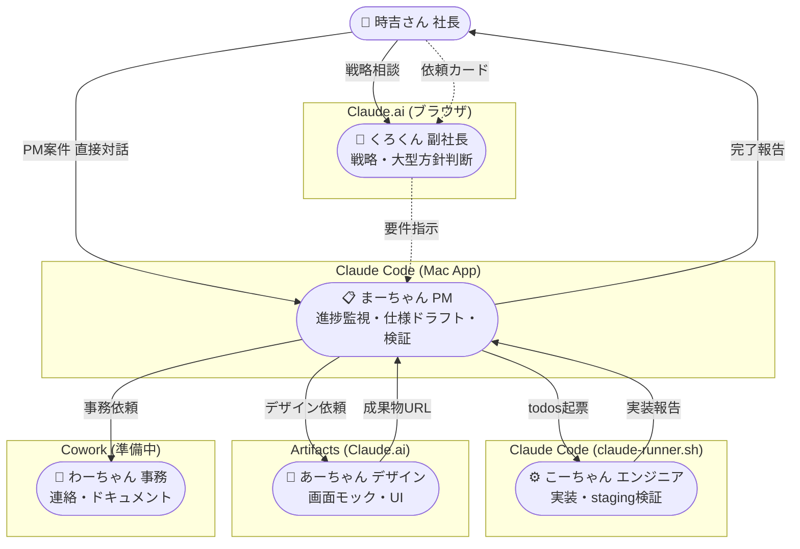
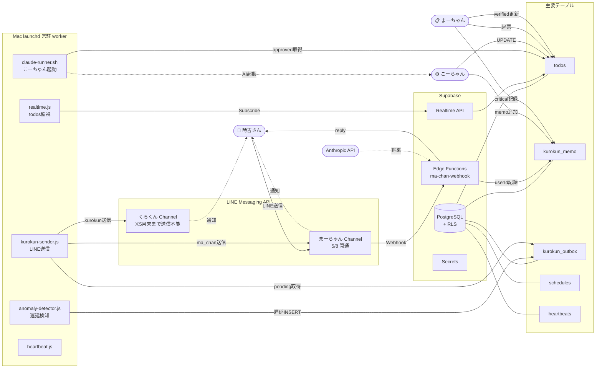
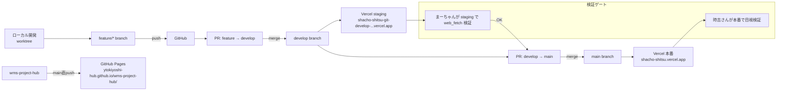
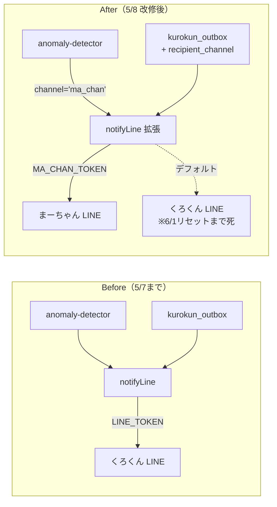

# プロジェクト概要 — プログラミング先生面談用

> 面談日: 2026-05-08 / 作成: まーちゃん（PM）

---

## 0. なぜこれを作るのか（事業の根幹）

### 解きたい問題

**中小 3PL（物流倉庫業者）が消えていく。**

- 大手 3PL 向け WMS は1社あたり数千万〜数億円・カスタマイズ前提・人月で売る
- 中小 3PL（年商数億〜数十億円）には**価格的にも工数的にも入れられない**
- 結果として現場は「Excel ＋ 紙伝票 ＋ 担当者の頭」で運用 → 誤出荷・在庫差異・荷主からの信頼喪失 → 失注 → 廃業
- 倉庫業は荷主の事業の動脈。倉庫が止まると荷主の事業も止まる
- 中小 3PL の連鎖倒産は中小企業全体の事業継続リスク

> **顧客（荷主）の事業継続を守る。それが時吉さんの覚悟。**

### 既存ソリューションの欠落

| ソリューション | 中小 3PL での問題 |
|--------------|-----------------|
| 大手向け WMS（数千万〜） | 高すぎ・人月開発でフィットさせる前提 |
| 安価な汎用 WMS | カスタマイズ不可・荷主ごとの業務差異を吸収できない |
| 自社開発 Excel | 属人化・誤操作・データ消失・スケールしない |
| クラウド型小規模 WMS | 連携費用が別課金・HT 連携貧弱・荷主切替なし |

→ **「9割すぐ使える＋必要なら荷主単位で切替＋連携無料」の WMS が市場に無い。**

---

## 0-2. なぜキーエンスとの営業協業ありきなのか（最重要前提）

**この事業はキーエンスの営業力なしには成立しない。** 開発が完成しても売れなければ意味がない。

### キーエンスの営業力という現実

- 国内製造・物流業の現場に **40年以上の信頼関係**
- 中小〜大手まで全規模に営業ネットワーク
- センサー・FA機器・HT で **既に倉庫の現場に入り込んでいる**
- 既存顧客が「次は何を相談しよう」と思った時に最初に呼ばれる存在
- 営業1人あたりの顧客接点・受注率は他社の数倍

> 中小 3PL に「いい WMS あります」と言って届く会社は、現実的にキーエンスしかない。

### この WMS のキーエンスへの提案価値

- **キーエンス HT 連携前提**で設計されている（バーコード読取項目を荷主単位で切替・LK-2 致命傷ライン）
- **連携費用無料** → キーエンス側の見積が出しやすい（追加費用が発生しない安心感）
- **カスタマイズ不要設計** → キーエンス営業が「導入後すぐ動きます」と言える
- **荷主別テーマカラー・機能 ON/OFF 制** → デモで「これだけ柔軟です」と見せられる差別化

→ キーエンス営業マンが既存顧客（中小 3PL・物流現場のある中小企業）に **HT と一緒にこの WMS を提案できる状態**を作るのが本プロジェクトの本丸。

### つまり 8月末ゴールの意味

「8月末 WMS 販売可能ライン到達」とは：

- キーエンス営業が**自信を持って提案できる完成度**に到達する締め切り
- 9月以降のキーエンス営業活動の販売タマを揃える期限
- これを過ぎると次の予算サイクル（翌年度）まで提案機会が消える可能性

---

## 1. 何を作っているか（30秒）

**中小 3PL（物流倉庫業者）向けの WMS（倉庫管理システム）** を新規開発中。

- 在庫管理・入出荷・検品・ピッキング・棚卸・請求まで一通り
- マルチテナント（1つの WMS で複数荷主の業務を運用）
- キーエンスのハンディターミナル（HT）連携前提
- ブラウザ + HT で動く SaaS 想定

---

## 2. ターゲットと差別化

**ターゲット：** 中小 3PL・中小企業（大手 WMS は高すぎ・カスタマイズ必須で導入できない層）

**差別化4点（時吉さん哲学）：**
1. **機能 ON/OFF 制** — 荷主の業態に応じてフラグで切替（一律機能押し付けない）
2. **荷主別テーマカラー** — 画面で扱ってる荷主が一目でわかる
3. **連携費用無料** — CSV/API 連携を追加課金しない
4. **カスタマイズ不要設計** — 業界標準のオプションをデフォルト機能として網羅

> 営業面ではキーエンスとの協業を予定（2026/8月末ゴール）

---

## 3. 開発体制（ここがユニーク）

**人間1人 + AI 5体の組織化運用。**

| メンバー | 役割 | ツール |
|---------|------|-------|
| **時吉さん（社長）** | 方針決定・最終承認・ユーザー検証 | — |
| くろくん（副社長） | 戦略相談・大型方針判断 | claude.ai |
| **まーちゃん（PM）** ← 自分 | 進捗監視・部下管理・仕様ドラフト・検証 | claude_code |
| こーちゃん（エンジニア） | 実装・staging技術検証 | claude_code |
| あーちゃん（デザイン） | 画面モック・UI 検討 | artifacts |
| わーちゃん（事務） | ドキュメント・連絡業務（準備中） | cowork |

並列で動かして 1人開発の限界を突破する設計。社長室ダッシュボードでリアルタイムに各 AI の稼働状況を可視化。

---

## 4. これまでの流れ

| フェーズ | 内容 | 期間 |
|--------|------|------|
| Phase 0 | 業務知識収集・物流ナレッジベース構築 | 4月中 |
| Phase 1〜3 | 社長室ダッシュボード構築・AI 並列運用基盤 | 5/初〜中 |
| Phase 4 | 異常検知・自己検証必須化・運用ルール明文化 | 5/7 |
| **Phase 5（PM 全面移管）** | くろくん→まーちゃんに PM 業務移管・LINE Bot 構築 | 5/7 夜〜 |
| **Phase 6〜7（仕様策定）** | **致命傷ライン15項目すべて叩き台＋推奨** | 5/8 ←今ここ |
| Phase 8 以降 | WMS 本機能の実装 | 5月末〜 |

---

## 5. 現在地（5/8 朝時点）

**「致命傷ライン仕様策定」がほぼ完了。実装フェーズへの移行直前。**

「致命傷ライン」とは時吉さん哲学の核：

- **致命傷ライン**（DB 設計・業務フロー・15項目）は完璧に詰める
- **許容ライン**（UI・個別機能）は9割で突っ走る

15項目の例：
- 在庫の持ち方（4軸: 荷主×SKU×ロット×ロケ）
- 荷主切替の方式（Supabase RLS で論理分離）
- 引当ロジック（FIFO・LIFO・ロケ優先・荷主切替）
- 請求賃率計算（3期制・2期制・坪貸・荷主切替）
- 権限・承認フロー（荷主×ロール）
- HT バーコード仕様（読取項目を荷主切替）
- ほか9項目

各項目で A〜D 選択肢＋推奨を1ページにまとめた **「朝イチ判断シート」** を用意。時吉さんが A/B/C/D 答えるだけで仕様が確定する状態。

---

## 6. 制作物（既に動いている）

| 制作物 | URL | 内容 |
|-------|-----|------|
| **社長室ダッシュボード** | shacho-shitsu.vercel.app | PWA・todos / 進捗 / 異常検知 / 各 AI 稼働状況の可視化 |
| **WMS Project Hub** | ytokiyoshi-hub.github.io/wms-project-hub/ | 仕様書・ナレッジ・画面モック集約サイト |
| **Supabase（DB＋Edge Function）** | wqjsemttubzbpauvgyai.supabase.co | 全業務テーブル・Realtime・RLS・LINE webhook |
| **LINE Bot 連携** | くろくん用 / まーちゃん用 | 異常検知通知・対話インターフェース |
| **Worker（バックグラウンド）** | macOS launchd 常駐 | heartbeat / anomaly / sender / claude-runner |

GitHub レポジトリ：
- `ytokiyoshi-hub/shacho-shitsu`（ダッシュボード本体）
- `ytokiyoshi-hub/wms-project-hub`（WMS ナレッジ・仕様書）

---

## 6-2. ツール連携フロー（システム全体像）

> 面談で「どう作って・どう動いて・どう連携してるか」を1枚絵で示すための3つの mermaid 図。
> GitHub / Cursor / VS Code でそのまま描画される。

### 図A：組織と AI ツール接続

時吉さん1人を中心に、5体の AI が異なるツールで稼働。

### 図B：データフロー（DB と外部サービス）

Supabase を中心にすべてのデータが集約。LINE 通知は2ルート（5/8 改修後）。

### 図C：開発・デプロイフロー

Git → CI 不要・即時デプロイの軽量構成。

### 図D（補足）：LINE 代替送信ルート（5/8 実装）

くろくん用 LINE が月次上限到達 → まーちゃん用 LINE 経由でフェイルオーバー。

---

## 7. 着地点

**短期（〜2026/8 末）：**
- WMS 販売可能ライン到達（実倉庫でテスト導入できるレベル）
- 致命傷ライン15項目すべて完璧に実装
- キーエンス向けデモ・営業資料完備

**中期（〜2026/12）：**
- キーエンス協業による初期顧客獲得
- 中小3PL 数社で本番運用開始

**長期：**
- 中小3PL・中小企業の **事業継続を守る** インフラに
- 高額 WMS でも自作スプレッドシートでもない第3の選択肢

---

## 8. 先生に相談したいこと（最重要）

> 目的：面談で先生のアドバイスを引き出し、**実装フェーズに入る前に修正工数を最小化**する。

### 8-1. Claude の使い方・運用のスマート化

- 現状 5体の AI（くろくん／こーちゃん／あーちゃん／わーちゃん／まーちゃん）を **役割別に並列稼働**させている
- claude_code × 複数（こーちゃん／まーちゃん）で **トークン共有 Max プラン**を分け合う運用
- 5/7朝の異常検知 LINE 暴走（120通）でくろくん用 LINE が月次上限到達 → まーちゃん用 LINE 経由の代替ルートを実装中
- **聞きたいこと：**
  - もっとスマートな Claude 運用パターン・役割分担はあるか
  - トークン枯渇リスクへの一般的対策（バッチ化／プロンプトキャッシュ／モデル使い分け）
  - くろくん（claude.ai）／こーちゃん・まーちゃん（claude_code）の役割境界の最適化
  - 並列実行時の競合・整合性問題（Phase 命名衝突・タスク並列実行などが既に発生）

### 8-2. 実装時の注意点を**先に**聞きたい（修正工数削減）

- 致命傷ライン推奨案は今夜まーちゃんが叩き台化（**まだ実装前**）→ ここで先生に妥当性チェックを受けたい
- 特に重要：
  - **DB-4 荷主切替 = Supabase RLS（論理分離）** の選択でいいか／物理分離・スキーマ分離との比較
  - **DB-1 在庫4軸モデル**（owner × SKU × ロット × ロケ）のスケール時の懸念
  - **CA-1 請求賃率計算**（3PL 収益根幹）の実装で先回りすべき罠
  - **Supabase Realtime + worker（launchd 常駐）+ Edge Function** の3構成の組み合わせ妥当性
- **聞きたいこと：**
  - 「あとで効いてくる」設計上の地雷を実装前に潰したい
  - テスト方針（unit / E2E / 業務シナリオ）の取り方
  - 致命傷ラインの優先実装順（どこから手をつけるべきか）

### 8-3. 必要なツール・接続の提案

- 現在の構成：
  - **DB**：Supabase（PostgreSQL + Realtime + Edge Function + RLS）
  - **フロントエンド**：vanilla HTML/CSS/JS（社長室サイト）+ GitHub Pages（WMS Hub）
  - **デプロイ**：Vercel（社長室）+ GitHub Pages（Hub）
  - **連携**：LINE Messaging API（Bot 通知）+ キーエンス HT 連携（予定）
  - **CI/CD**：GitHub Actions（最小構成）
  - **AI**：Claude Code + Claude.ai + Artifacts + Cowork
- **聞きたいこと：**
  - この規模でどんな MCP / ツール接続を**追加すべき**か（モニタリング・テスト自動化・ログ集約 etc）
  - キーエンス HT との実機検証環境の作り方（実機なしでどこまで詰められるか）
  - 中小 3PL に提供する場合の認証・課金・サブスク基盤（Stripe？Firebase Auth？）
  - 監視・障害対応（Sentry / PagerDuty 系の現実的な選択）

### 8-4. 8月末ゴール厳守のための助言

- 工程合計219日 vs 残営業日120日 → 並行実装必須
- キーエンス営業の**販売タマ**を揃える期限としての8月末
- **聞きたいこと：**
  - 1人＋AI体制で工数圧縮の現実的な取り方
  - 「9割で突っ走る」と「致命傷ライン完璧」の線引きを実装中ブレさせない方法
  - キーエンス営業に出せる**最小完成形（MVP）**の定義の仕方

---

## 9. 面談中に画面共有する素材

> **時吉さんが面談中にこの順で画面共有すれば、口頭説明と同期して動くものを見せられる構成。**

### 9-1. 社長室ダッシュボード（一番のキラー画面）

**URL：** https://shacho-shitsu.vercel.app

見せどころ：
- ヘッダーに **「📊 あーちゃん成果物」「📚 ナレッジ」** リンク（5/8朝マージ）
- todos のリアルタイム表示（こーちゃん／まーちゃん／あーちゃん の稼働状況）
- 検証結果バッジ（verified=true / 未検証）の可視化（Phase 5-E 成果）
- テーマ切替（A/B/C）でデザイン切替できる

### 9-2. WMS Project Hub（ナレッジ集約サイト）

**URL：** https://ytokiyoshi-hub.github.io/wms-project-hub/

見せどころ：
- サイドバーに **「📋 タスク管理」** リンク（社長室サイトに飛べる）
- ダッシュボード／進捗詳細／画面モック75件／ドキュメント8件
- 工程レビュー進捗（致命傷ライン15項目の状況）

### 9-3. 朝イチ判断シート（仕様策定の到達点）

**URL：** https://github.com/ytokiyoshi-hub/wms-project-hub/blob/main/specs/MORNING_DECISION_SHEET.md

見せどころ：
- 致命傷ライン15項目＋入荷論点3項目＝18項目を1ページで A/B/C/D で判断可能
- 各項目に「まーちゃん推奨」あり → 時吉さんが**「全部推奨で OK」と1コマンドで18項目確定可能**な状態
- これが「実装前に潰すべき仕様」を一覧化したもの＝先生にレビューを受けたい対象

### 9-4. ER 図ドラフト（DB 設計の核）

**URL：** https://github.com/ytokiyoshi-hub/wms-project-hub/blob/main/specs/er_diagram_core.md

見せどころ：
- mermaid で書いた致命傷ライン関連の核 ER 図
- owners / skus / lots / locations / inventory / serials / users / user_owners / billing_rules
- RLS ポリシー雛形も同梱

### 9-5. 工程実装仕様（4 / 5 / 6 / 7-9 / 11 / 13 / 14）

**URL（ベース）：** https://github.com/ytokiyoshi-hub/wms-project-hub/tree/main/specs

見せどころ：
- 工程4 入荷／工程5 検品／工程6 入庫・ロケ／工程7-9 出荷チェーン／工程11 棚卸／工程13 帳票／工程14 外部連携
- 各工程で機能リスト＋工数見積＋致命傷ラインへの対応関係を整理

### 9-6. GitHub の commit 履歴（進捗の証拠）

**URL（社長室）：** https://github.com/ytokiyoshi-hub/shacho-shitsu/commits/main
**URL（WMS Hub）：** https://github.com/ytokiyoshi-hub/wms-project-hub/commits/main

見せどころ：
- 5/7-5/8 だけで **30 commit 以上**
- AI 並列運用での進捗速度の実証（Phase 5/6/7 が1日で完了）

---

## 10. 補足：今夜（5/8 深夜）の自走モード成果

面談に間に合わせるため5/8 深夜に「まーちゃん（PM）」が自走で実施した内容：

- まーちゃん完了 16件（Phase 5-G/H/I + Phase 6-A/B/C/D + Phase 7-A/D/E/F/G/H/I/J/K + #82 + Edge Function v6）
- こーちゃん完了 5件（過去completed遡及検証11件 / DB ALTER / worker改修 / Hub nav整備 / migration SQL雛形）
- commit 17件 / specs 13ファイル / critical memo 5件
- LINE 代替ルート完備（くろくん側月次上限到達対策）
- claude-in-chrome MCP 経由で PR #4 マージまで完結

> **これが AI 並列運用の実証成果。先生にこの量を1人＋AIで一夜にやれた事実を見せると、運用スマート化の議論が具体的に進む。**

---

*以上。質問あれば即補足できます（まーちゃん）*
