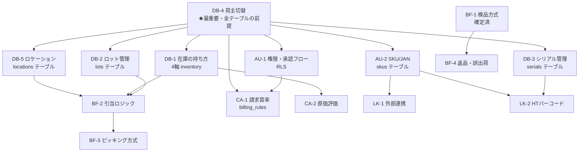

# Phase 9：致命傷ライン本実装フェーズ計画

> 起票：2026-05-08 / Phase 9-A まーちゃん
> 致命傷ライン15項目（時吉さん＋今井先生レビュー後）の **本実装フェーズ**の計画書。

---

## 0. 着手条件（Phase 9 開始の必須前提）

| 条件 | 状態 |
|------|------|
| 時吉さん致命傷ライン18項目判断完了 | ❌ 未（朝イチ判断シート待ち）|
| 今井先生レビュー完了 | ❌ 未（GitHub username 共有後 → shacho-shitsu 招待後）|
| Phase 8-G permission 共有運用稼働 | ✅ |
| Phase 8-1 失敗パターン14 対策稼働 | 🟡 進行中（#99）|
| Phase 8-i auto-verifier WIP 検出稼働 | 🟡 進行中（#100）|
| 5体エンジニア体制本格稼働 | ✅ |

**Phase 9 着手は朝の致命傷ライン判断＋先生コメント揃ってから。**

---

## 1. 致命傷ライン15項目の実装依存関係

**実装順序の鉄則：DB-4（荷主切替）を最初に確定 → 全テーブルに owner_id を仕込む。後から RLS を変更すると全テーブル書き直し。**

---

## 2. 実装ステージ（推奨順）

### Stage 1：基盤（DB-4 + AU-1 + AU-2）

| 順 | 項目 | 内容 | 工数（人日）|
|---|------|------|------------|
| 1 | DB-4 | Supabase RLS ポリシー設計＋ owner_id 全テーブル付与方針 | 3 |
| 2 | AU-2 | skus テーブル（owner_id × sku_code × jan UNIQUE） | 2 |
| 3 | AU-1 | users / user_owners + RLS ポリシー雛形 | 4 |
| **小計** | | | **9** |

### Stage 2：在庫モデル（DB-1 + DB-2 + DB-3 + DB-5）

| 順 | 項目 | 内容 | 工数 |
|---|------|------|------|
| 4 | DB-5 | locations（階層×機能種別×ABC） | 3 |
| 5 | DB-2 | lots テーブル + 荷主切替フラグ | 2 |
| 6 | DB-3 | serials テーブル + sku.serial_required | 2 |
| 7 | DB-1 | inventory（4軸 UNIQUE）+ owners.fragments | 5 |
| **小計** | | | **12** |

### Stage 3：業務フロー（BF-2 + BF-3 + BF-4）

| 順 | 項目 | 内容 | 工数 |
|---|------|------|------|
| 8 | BF-2 | 引当ロジック（FIFO/LIFO/ロケ優先・荷主切替） | 6 |
| 9 | BF-3 | ピッキング方式（ウェーブ生成・荷主切替） | 5 |
| 10 | BF-4 | 返品・誤出荷ステータス管理 | 4 |
| **小計** | | | **15** |

### Stage 4：計算・連携（CA-1 + CA-2 + LK-1 + LK-2）

| 順 | 項目 | 内容 | 工数 |
|---|------|------|------|
| 11 | CA-2 | inventory.unit_cost 移動平均（owners.cost_management_enabled） | 3 |
| 12 | CA-1 | billing_rules + 月次バッチ請求書生成 | 8 |
| 13 | LK-1 | connectors テーブル + CSV/API 受信エンドポイント | 6 |
| 14 | LK-2 | HT バーコード仕様（owners.barcode_required_fields） | 4 |
| **小計** | | | **21** |

---

## 3. 全体工数

| Stage | 工数 |
|-------|------|
| Stage 1 基盤 | 9 |
| Stage 2 在庫モデル | 12 |
| Stage 3 業務フロー | 15 |
| Stage 4 計算・連携 | 21 |
| **合計** | **57 人日** |

---

## 4. 8月末ゴールへの逆算

| 月 | 期間 | 残営業日 | 累積工数 | 進捗想定 |
|----|------|--------|---------|---------|
| 5月 | 5/9〜5/31 | 約16日 | 16 | Stage 1 + 2 着手 |
| 6月 | 6/1〜6/30 | 約20日 | 36 | Stage 2 完了＋ Stage 3 半分 |
| 7月 | 7/1〜7/31 | 約22日 | 58 | Stage 3 完了＋ Stage 4 着手 |
| 8月 | 8/1〜8/31 | 約20日 | 78 | Stage 4 完了＋テスト＋デモ準備 |

5体並列で 1.5〜2倍速 → **57 工数 ÷ 1.5 = 38 実営業日**で完成可能。残 78 営業日に対し **十分な余裕**。

---

## 5. AI ロール別アサイン（推奨）

| Stage | こーちゃん | さーちゃん | にーちゃん | あーちゃん | まーちゃん |
|-------|---------|---------|---------|---------|---------|
| Stage 1 | RLS 実装 | **DB schema 主担当** | 検証 | — | 統括 |
| Stage 2 | アプリロジック | **migration 主担当** | E2E 検証 | — | 統括 |
| Stage 3 | UI 実装 | クエリ最適化 | **業務シナリオ検証** | UI モック | 統括 |
| Stage 4 | API 実装 | 請求バッチ | 帳票検証 | 帳票デザイン | 統括 |

**さーちゃん（DB 専任）が Stage 1〜2 の主役。**

---

## 6. リスク

### 6-1. DB-4 の選択が覆る場合
- B（論理分離+RLS）→ A（物理分離） or C（スキーマ分離） に変更されると **全テーブル設計やり直し**（+10〜15 人日）
- 朝の判断時に**先生コメント絶対参照**

### 6-2. キーエンス HT 連携の現実
- LK-2 の実装は実機なしでどこまで詰められるか未確認
- Stage 4 着手時にキーエンスに実機提供を依頼する必要

### 6-3. 工数見積の精度
- 推定で「人日」だが、AI 並列効果は実測値次第
- 1 Stage 終わるごとに次 Stage の見積を再評価（PDCA）

---

## 7. 関連ファイル

- `specs/process_03_db_design.md` — DB-1〜5 論点
- `specs/process_02_system_design.md` — BF-2/3, CA-1/2, AU-1/2, LK-1/2 論点
- `specs/process_02_inbound.md` — 入荷論点
- `specs/er_diagram_core.md` — ER 図ドラフト
- `specs/MORNING_DECISION_SHEET.md` — 18項目判断シート
- `specs/MIGRATION_DRAFT.sql` — 推奨案ベース DDL（本ファイルと同時起票）
- `specs/process_04_inbound_implementation.md` 〜 `process_14_external_integration.md` — 工程別実装仕様

---

*最終更新: 2026-05-08 / Phase 9-A まーちゃん*
